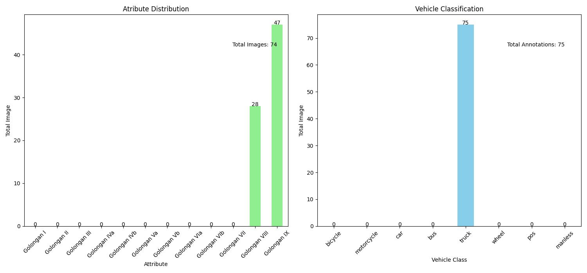
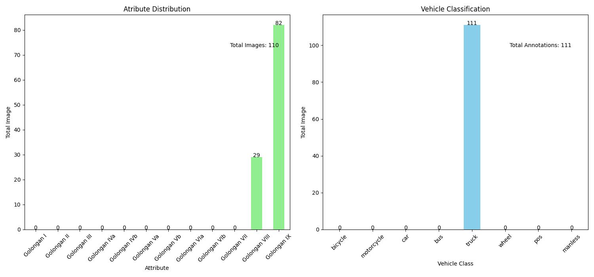

# ASDP Dataset Klasifikasi Kendaraan

## Table of Contents

- [ASDP Classification](#asdp-classification)
  - [Table of Contents](#table-of-contents)
  - [Introduction](#introduction)
  - [Versions](#versions)
  - [Guidelines](#guidelines)

## Introduction

asdp classification is a dataset repository for the classification of 12 vehicle classes. The dataset was collected from the Merak and Bakauheni port locations and annotated with CVAT. This repository was created using DvC and Minio for version control and data storage.

## Versions

### ASDP Classification

| Version | Tag    | Attributes                          | Description             |
| ------- | ------ | ----------------------------------- | ----------------------- |
| v1.1    | `v1.1` |  | Add TASK #533 #508      |
| v1.2    | `v1.2` |  | Add TASK #533 #508 #559 |
